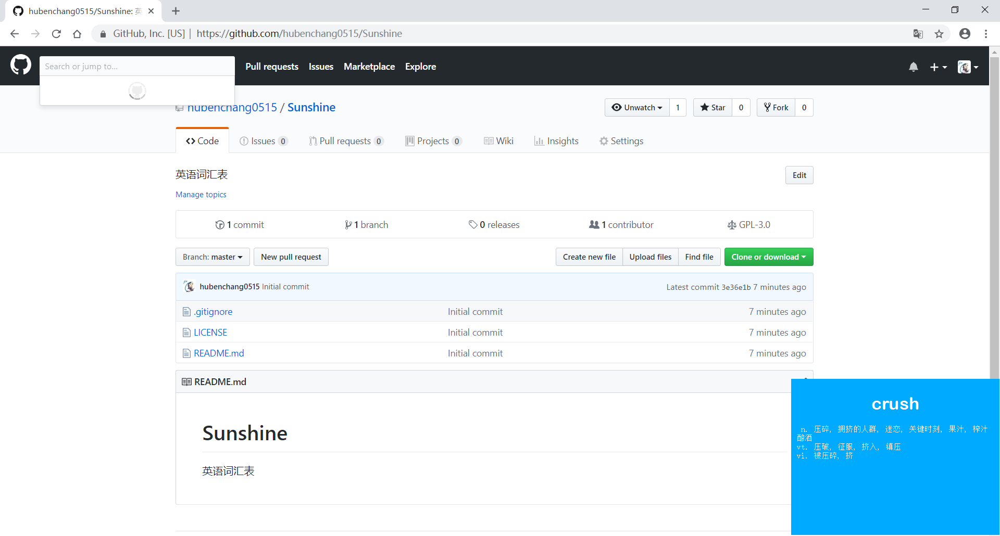

# Sunshine
利用余光记单词的软件，可在工作或娱乐时使用。  

* 程序窗口会置顶，并每15秒钟随机刷新一个单词。
* 通过托盘图标显示、隐藏和退出程序。
* 可以更换.exe同目录下的数据库文件database.db来更改词汇表。
* 在src/res目录下提供了一些常用的词汇表数据库。
* 数据库采用SQLite3。
* 通过IDE运行时，数据库应放置在IDE设置的工作目录，通常为build目录。

## 数据库
* 类型 : Sqlite
* 表名 : words  
* 列名 : | id | english | chinese |   

## 图示

